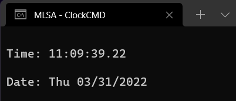

# ClockCMD
Ejemplo sencillo de un reloj digital hecho con CMD Scripts
## Instrucciones
- Descarga el archivo [clock_cmd.txt](clock_cmd.txt)
- Una vez descargado, abre el archivo en tu bloc de notas o cualquier editor de texto
- Guarda el archivo como uno nuevo con la extension **.bat**
  - Ejemplo: `clock_cmd.bat`
- Se generará un nuevo archivo en tu computadora. Lo puedes ejecutar dando doble click

Y listo, ya tienes el ejemplo de un reloj digital hecho en CMD script
## Salida

### Contribuidores
[@ManuOSMx](https://github.com/ManuOSMx)
